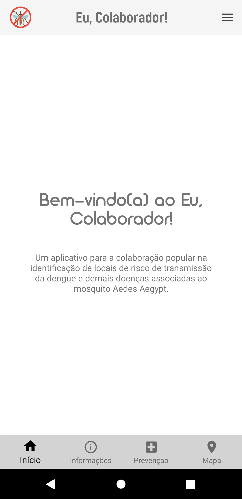

# Eu, Colaborador - Android APP

<span style="display: block; text-align:center;">
    
</span>

## Requisitos

Este aplicativo foi desenvolvido usando as seguintes ferramentas:

- IntelliJ IDEA Community Edition 2020.3
- Java JDK 15
- Android JDK v29

## Configuração do ambiente de desenvolvimento

- **Passo 1**: Verifique se você possui o [Kit de Desenvolvimento do Java (JDK)](https://www.oracle.com/java/technologies/javase/jdk15-archive-downloads.html) instalado no computador. Este aplicativo está configurado para usar a versão 15. Você pode verificar a versão instalada executando o seguinte comando no terminal do seu SO:

  ```bash
  javac --version
  ```

- **Passo 2**: Faça o _dowload_ do IntelliJ IDEA Community Edition e instale em seu computador. Você pode obtê-lo [neste link](https://www.jetbrains.com/pt-br/idea/download).

- **Passo 3**: Faça o download do Android Studio e instale localmente no seu computador. Em seguida execute o mesmo e faça a instalação do Android SDK v29 (Android 10) e do Dispositivo Virtual Android (AVD) em Configure > SDK/AVD Manager.

- **Passo 4**: Adicione este projeto ao seu workspace no IntelliJ. Após isso, faça o _build_ da aplicação através do menu Build > Build Project.

- **Passo 5**: Se você seguiu os passos anteriores e não ocorreram erros durante o processo, você será capaz de executar o aplicativo no dispositivo virtual selecionando o menu Run.
